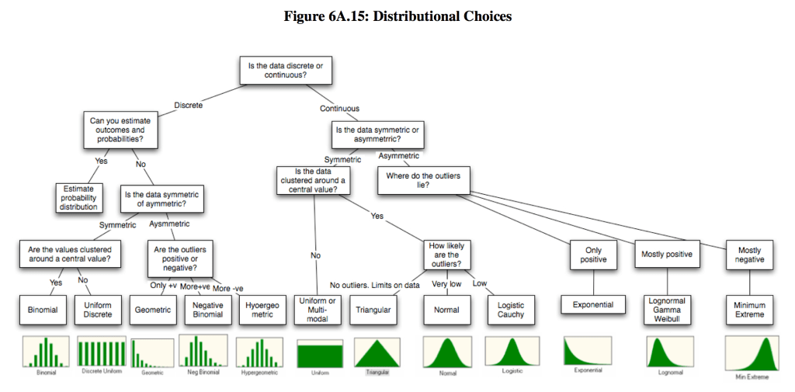
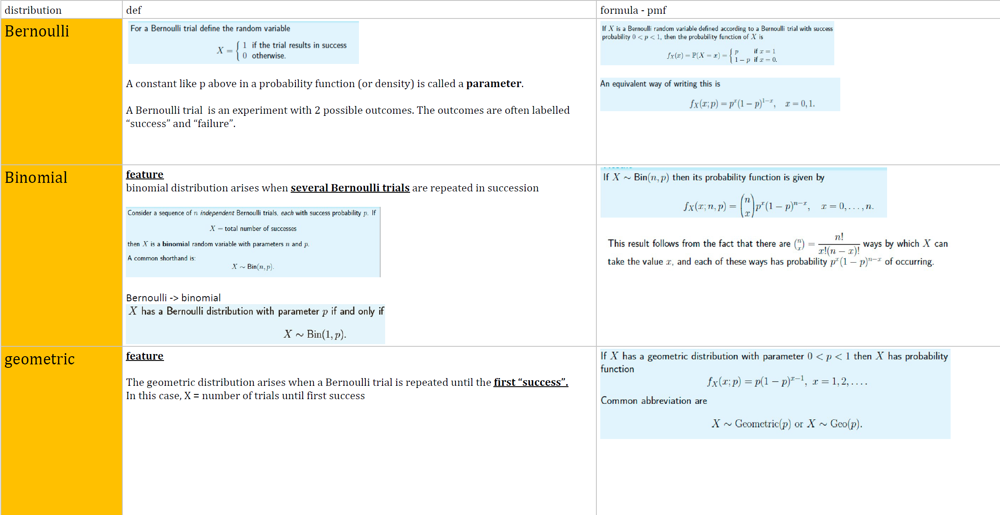
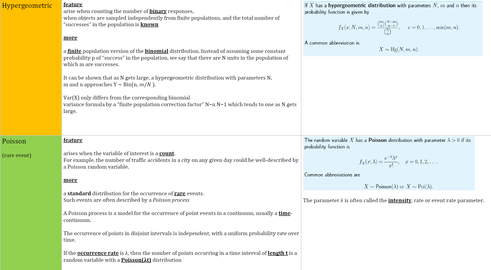
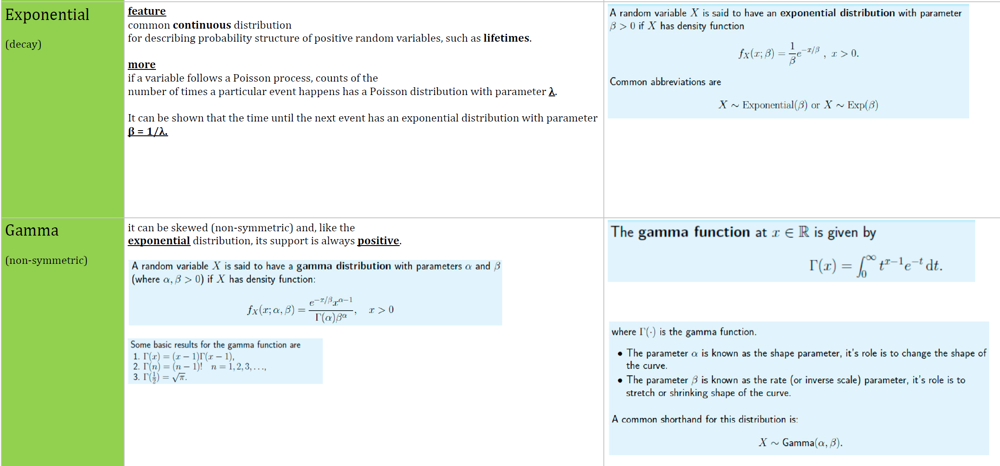
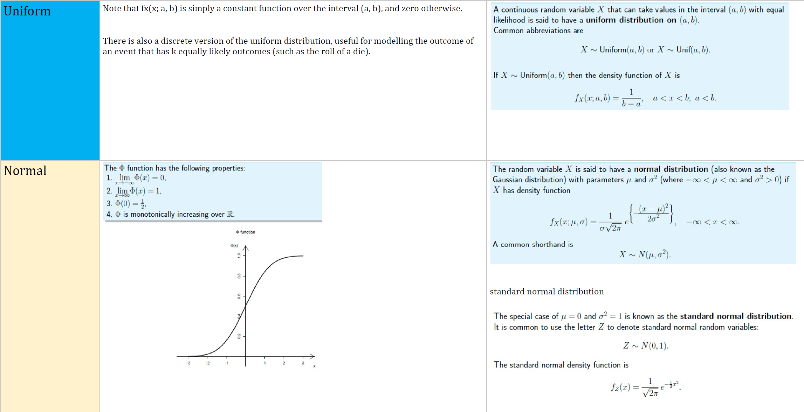
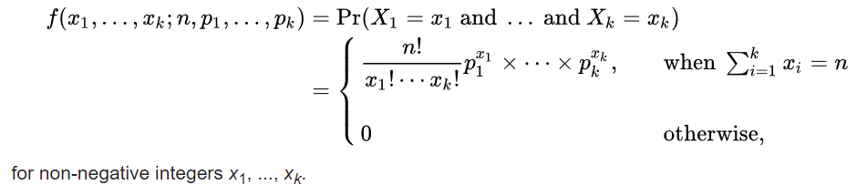

source from: [Types of Continuous Probability Distribution?](https://analyticsbuddhu.wordpress.com/2017/02/26/how-many-types-of-continuous-probability-distribution/)

**Multinomial** 
\#notes Extension on the bi-nomial dist
